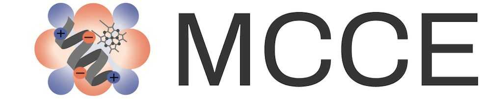

# Multi-Conformation Continuum Electrostatics

  

## Welcome to the **MCCE4-Alpha**! 
**Let's Get Started:** 

🛠️ [Installation](https://gunnerlab.github.io/mcce4_tutorial/docs/installation/) ·
🚀 [Quick Start](https://gunnerlab.github.io/mcce4_tutorial/docs/guide/quick_start/) ·
📖 [Full Documentation](https://gunnerlab.github.io/mcce4_tutorial/)

This tutorial walks you through calculating and analyzing **electrostatic interactions** from a PDB structure.  
You’ll find step-by-step practical examples designed to help new users quickly run simulations and understand key features of MCCE4.

## MCCE4-Tools 🔧  
🧰 **Explore Now:** [MCCE4-Tools GitHub](https://github.com/GunnerLab/MCCE4-Tools)

Please also check out the companion repository **MCCE4-Tools**.  
This repository contains additional utilities and scripts to make your MCCE4-Alpha experience even more useful!

---

## **Quick Introduction**

Given the structure of a macromolucule (in a PDB file), **MCCE4** can predict the following:

- **pKₐ values**
- **Protonation states**
- **Electrostatic properties** of biomolecules

In this program, protein side chain motions are simulated explicitly while the dielectric effect of solvent and bulk protein material is modeled by continuum electrostatics.

## **Documentation Overview**
Comprehensive documentation covering:
- Installation
- Guide: Detailed explanations of all settings
- Example Projects 

## Help us improve MCCE4
This is a testing version of MCCE4 development. 
Please let us know about questions, comments or report any issues you encounter [here](https://github.com/GunnerLab/MCCE4-Alpha/issues).
Thank You and we hope you enjoy using MCCE4!  

# MCCE Wiki
[Learn about MCCE, installation, available tools, and research done with MCCE.](https://mccewiki.levich.net) (under construction)

---

Copyright (C) 2024 GunnerLab

This software is distributed under the terms the terms of the MIT licence

