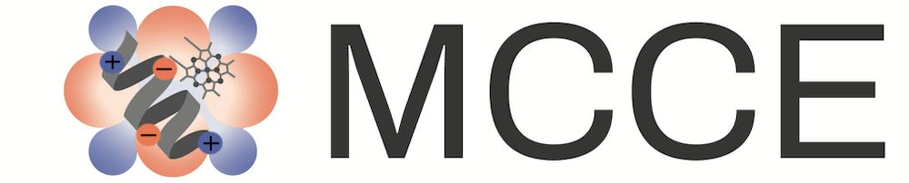

# Multi-Conformation Continuum Electrostatics

<p align="center">
  
</p>

# Welcome to MCCE4-Alpha!  
Please see our CHANGELOG at the bottom for the latest updates!

## Quick Introduction
Given the structure of a macromolucule (in a PDB file), __MCCE4__ can predict the following:
- Residue pKₐ, cofactor Eₘ and protein PI in protein-solvent systems
- Protonation States and ionization changes in response to protein structural changes
- Location and stoichiometry of proton transfers coupled to electron transfer

In this program, protein side chain motions are simulated explicitly while the dielectric effect of solvent and bulk protein material is modeled by continuum electrostatics.

## Documentation & Tutorials
# [__📖 MCCE4-Alpha Tutorial__](https://gunnerlab.github.io/mcce4_tutorial/) 

Comprehensive documentation covering:
- Installation
- Guide: Detailed explanations of all settings
- Example Projects 

## CHANGELOG:
<!--- NOTE TO EDITOR: Use tis line to indicate that the uses rmust/should update their clone"
  - __Apply changes: cd to your clone, then run `git pull`__
-->
_This section will reflect important changes and will provide you with information on how to apply them; For example, if new python packages are added to the environment file (mc4.yml), then the entry pertaining to that change will list the command(s) to update your environment._ 

* 2026-01-08:
  - Updated python dependencies in mc4.yml
  - __Apply changes: run these commands:__
  ```
  CLONE=$(dirname $(dirname "$(readlink -f "$(which mcce)")")); echo "$CLONE"
  conda env update -n mc4 -f "$CLONE/mc4.yml
  ```

* 2025-11-25:
  - step1.py: Added error trapping on atom.loadline call
  - mfe.py: Updated & moved to MCCE_bin
  - __Apply changes: cd to your clone, then run `git pull`__

* 2025-11-11:
  - Fixed deleterious typo in bin/pdbs_interfaces.py
  - __Apply changes: cd to your clone, then run `git pull`__

* 2025-10-30:
  - Updated README: Added CHANGELOG, link to sudo_install.txt
  - Added topologies for SO4 and PO4 in param/.
  - Updated bin/step3.py with longer timeout value
  - Updated MCCE_bin/quick_install.sh
  - __Apply changes: cd to your clone, then run `git pull`__

---

## Help us improve MCCE4
This is a testing version of MCCE4 development. 
Please let us know about questions, comments or report any issues you encounter [here](https://github.com/GunnerLab/MCCE4-Alpha/issues).
Thank You and we hope you enjoy using MCCE4!  

## MCCE Wiki
[Learn about MCCE, installation, available tools, and research done with MCCE.](https://mccewiki.levich.net) (under construction)

---

Copyright (C) 2024 GunnerLab
This software is distributed under the terms the terms of the MIT licence
