# Developer Manual

## Develop Cycle

Developers are encouraged to develop code incrementally, with each cycle solving a small task. Issues and project tools in Github made possible to track the progress of the project automatically.

The MCCE4 repository is at https://github.com/GunnerLab/MCCE4.

The MCCE4 backlog is at: https://github.com/orgs/GunnerLab/projects/4

Here is my workflow for example:

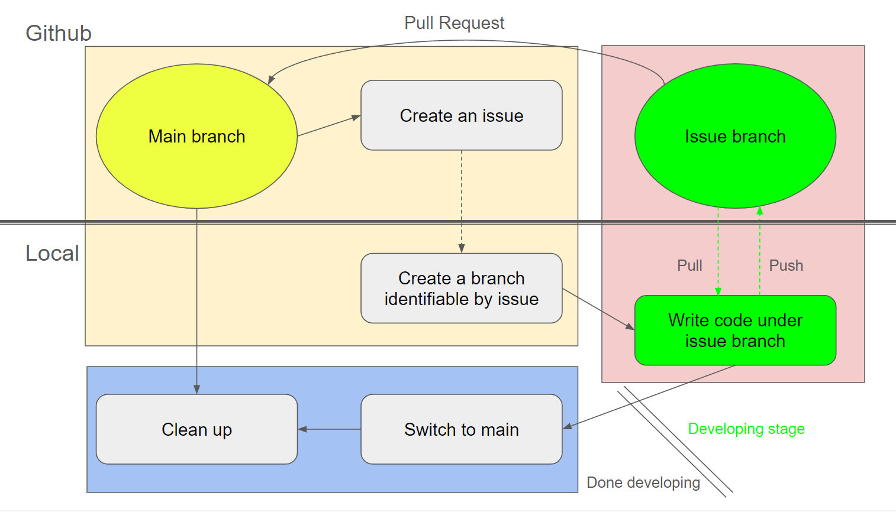

### 1. Initial setup

**On [Github](https://github.com/GunnerLab/MCCE4/issues):**

Create an issue to let others know what I am working on.
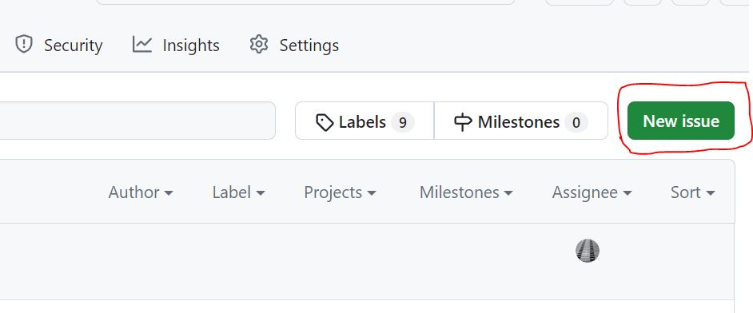

Once a new created, an issue number is returned. I personally use this issue number to name my branch.
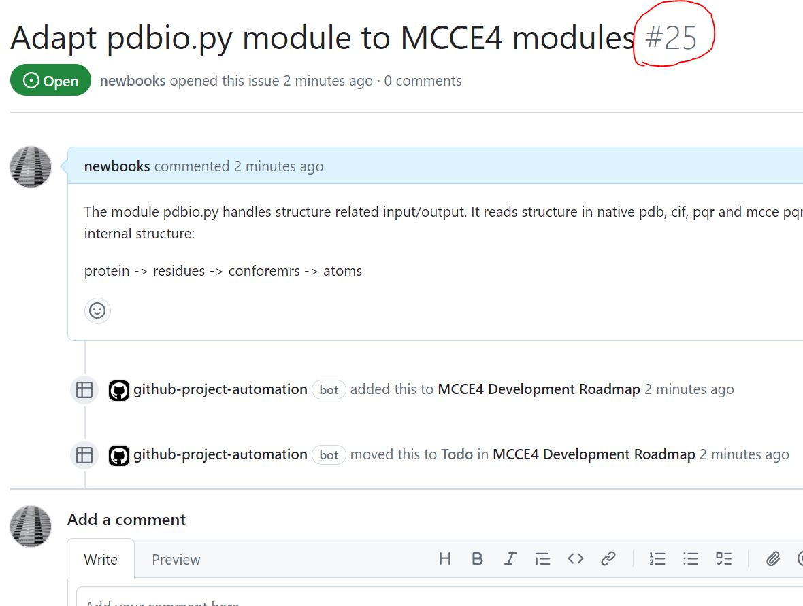

This issue will be automatically tracked by [mcce4 project](https://github.com/orgs/GunnerLab/projects/4/views/1).
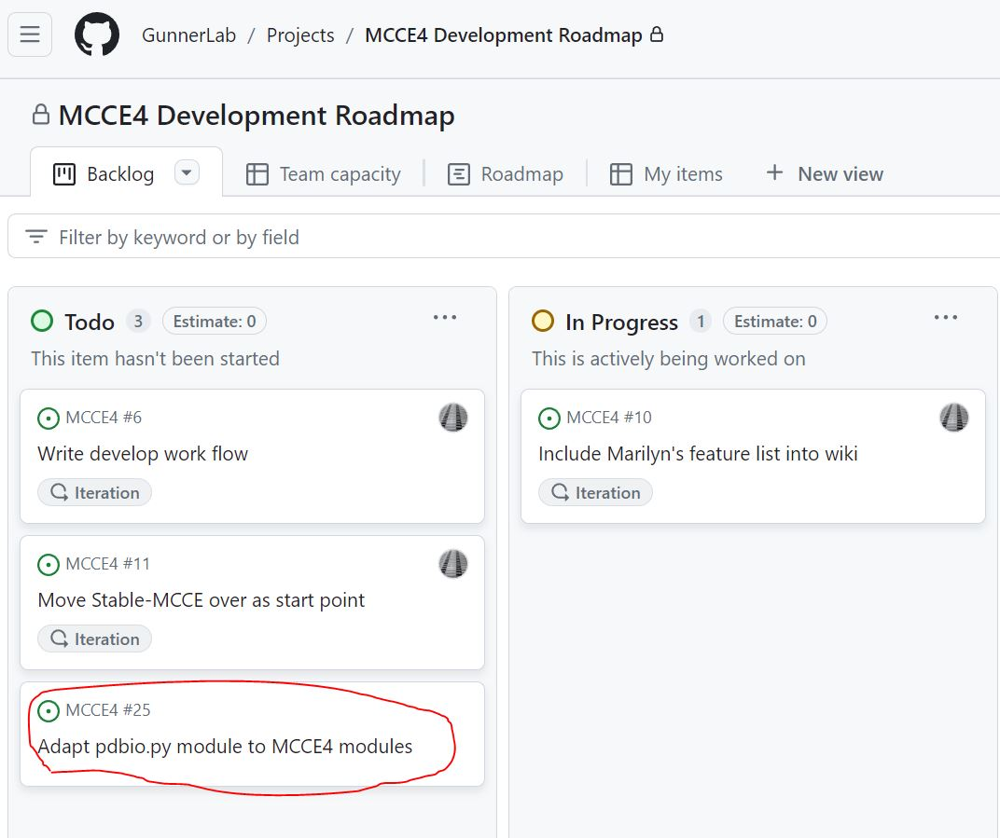

For this issue to move from "To Do" to "In Progress", go to the issue, close and reopen this issue. This is not perfect, but is Github's current way to trigger the status change.
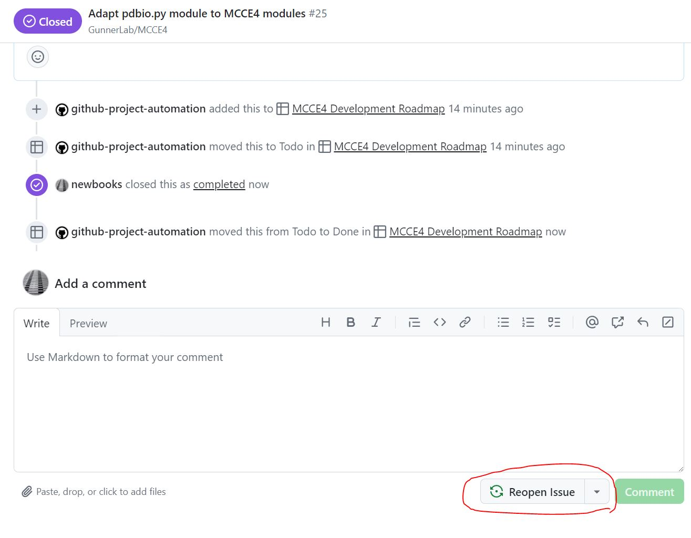

Assing the issue to myself,
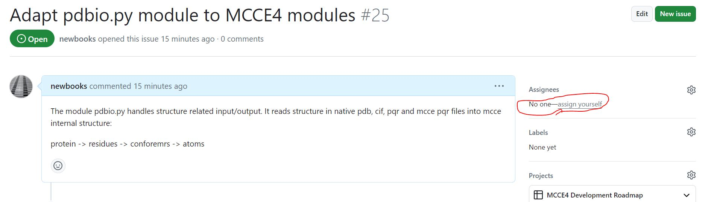

This results in the correctly tracked issue, and now it is all set on Github.
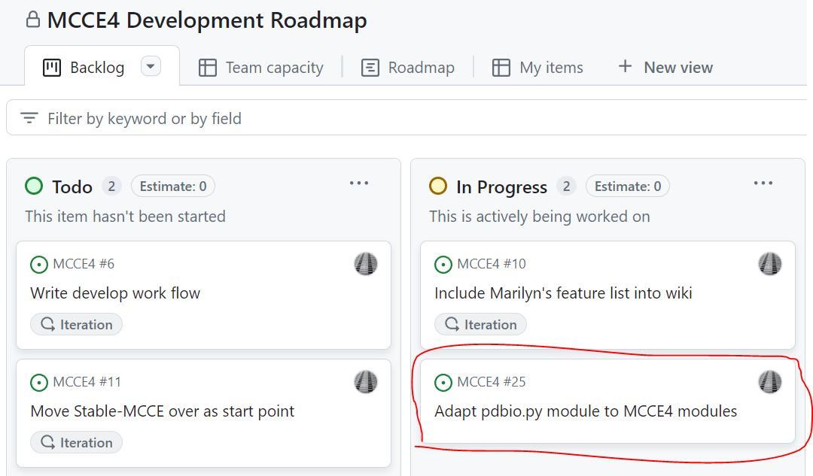

**On local computer:**

Create a branch with the issue name and check in.
<pre>
git checkout -b issue#25
</pre>
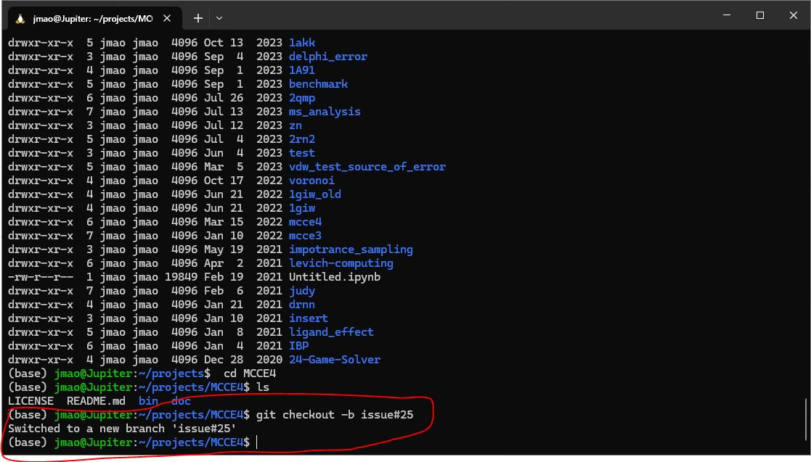

### 2. Write code and sync to theh branch

During the code development, I synchronize my local branch, in office and at hom, with the remote branch from time to time. Once the code is done, I include "closes #25" in the the last commit message. This is optional. Its function is to inform Github to close issue #25 when merged.
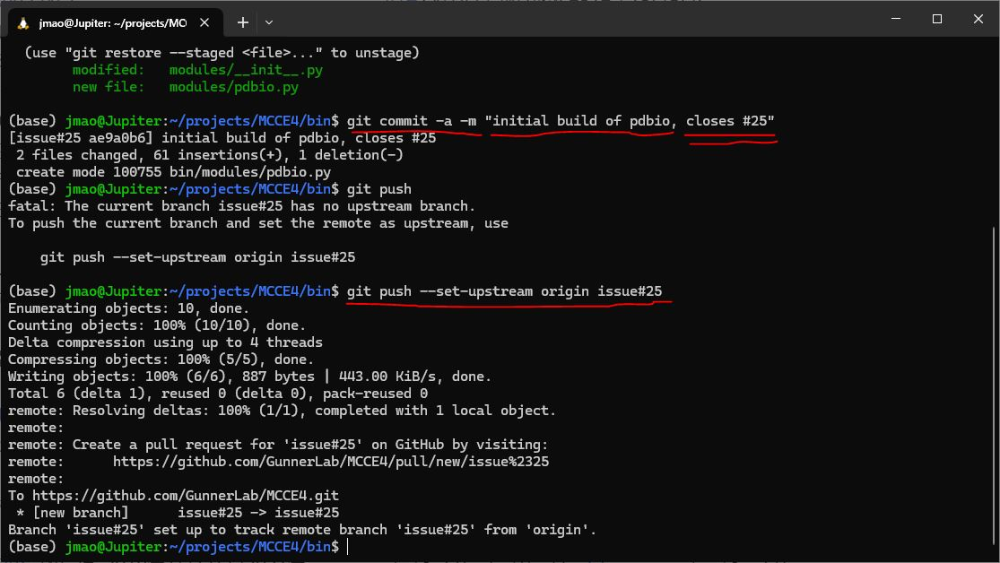

### 3. Clean up
Clean up consists these steps:
1. Pull request
2. After pull request is approved, update local main from remote main
3. Delete remote and local development branch
4. Update documentation about the code if necessary

When the code is ready to be put back to the main code base, do a pull request.

Go to Github https://github.com/GunnerLab/MCCE4, it is likely a pull request button is already presented.
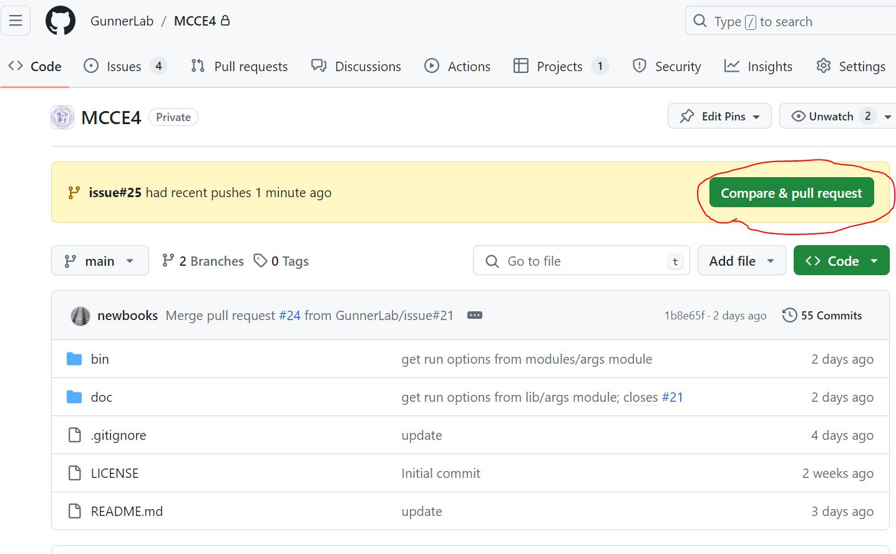
If no prompt at the code page, one can create the pull request from Pull Requests Tab. Pay attention to the merge direction in manual pull request. It should be from the branch to main.
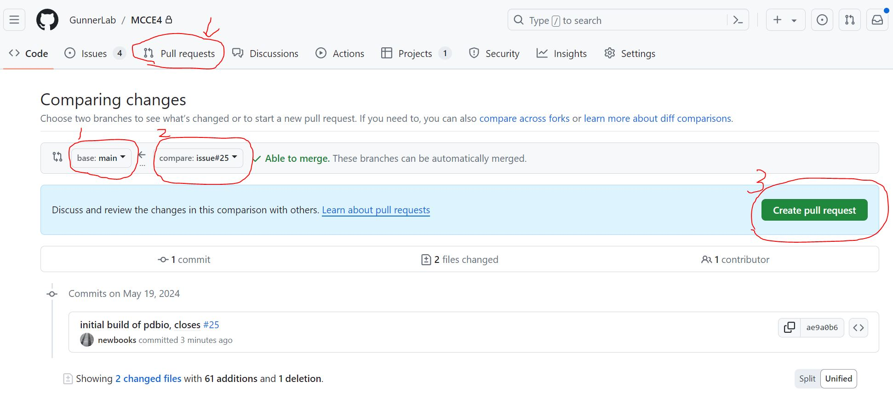

After submitting pull request, it is a good idea to let the admin or other developers to test, give you feed back, and approve the pull request. 

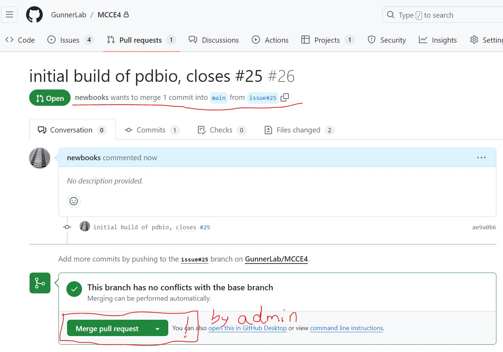

Once the pull request is approved, the code is merged to main. I can then switch to my main branch at local and update from the remote main. Then delete the local development branch. 
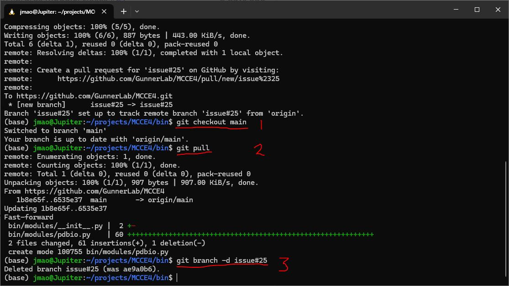

The admin may or may not have deleted the remote development branch. The author of the code can check and delete the remote branch too at this point. To do that, got to [github MCCE4 all branches](https://github.com/GunnerLab/MCCE4/branches) page, click on the trash icon of your development branch.

By now, the issue should have status "Closed"
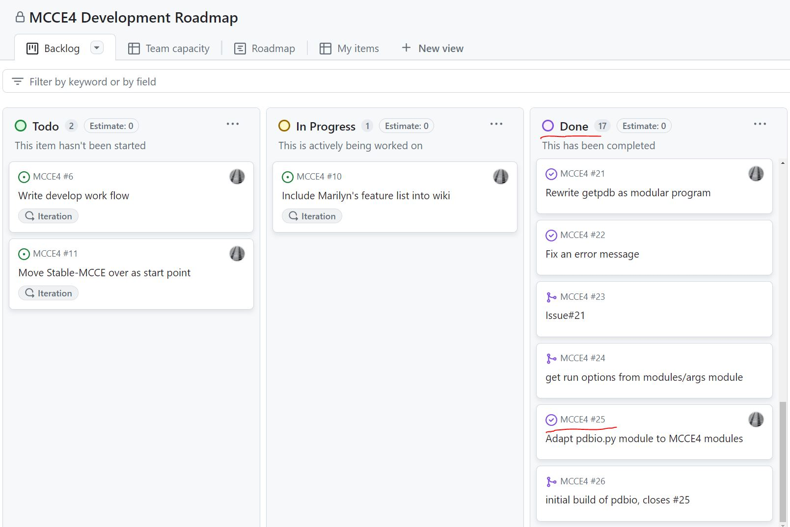

If not closed (usually because of the lack of keyword "closes #" with issue number in the merged commit), got to [issues](https://github.com/GunnerLab/MCCE4/issues), manully close the issue.

## Program and Data Structure
### Code structure
All programs and executables are put into bin directory. Constants, data structures, classes and modules are stored under modules of bin so that they can be easily imported, and more importantly, all code is self-contained in this structure. Parameter sets are put under param folder. The following is an illustration:
<pre>
└──root
   ├── bin (Stable-MCCE executables, will phase out once developed in MCCE_bin)
   ├── MCCE_bin 
   │    ├── * (mcce main programs and tools are placed under Python root directory bin) 
   │    └── mcce4 
   │          ├── __init__.py (set __all__ variable to define importable modules by *)
   │          ├── module1.py (python module that define some classes)
   │          └── *.py (Other Python modules)
   ├── param 
   │     ├── parse
   │     │    └── *.ftpl (parse parameter set files)
   │     ├── amber
   │     │    └── *.ftpl (amber parameter set files)
   │     └── nbo
   │          └── *.ftpl (nbo parameter set files)
   ├── doc
   │     └── *.md (documentation files)
   └── tests
         ├── testcase1/
         ├── testcase2/
         └── testcase*/
</pre>

As long as the code structure rule is followed, one can either use relative path (python module imports for example), or locate the invoking program's absolute path with `os.path.abspath(__file__)` (differentiate from working directory that Python file I/O assumes for example) then traverse to any other folders, programs or parameters you want to access. Therefore the scripts, modules, and parameters within the same mcce distribution can be prioritized.

Example statement:
<pre>
current_folder = str(os.path.dirname(os.path.abspath(__file__)))
</pre>

Except 3rd party programs, programs and scripts in bin folder should support command line options and "-h" for help manual.

### Global Constants and Default Values

### Run options
Command line options are processed in file bin/lib/args.py. Options are converted to appropriate date types and stored as class elements.

Importing run options module in bin directory:
`from modules.args import *`

#### GetpdbOptions:
* pdbid: 
  * Type: string
  * Value: PDB ID in command line

Example:
<pre>from modules.args import *
options = GetpdbOptions()
pdb = options.pdbid
</pre>

### Protein structure

### Energy Lookup Table Structure

### Microstates Structure

## External Resources
### Python code writing style
PEP 8 style is a wildly followed style. 

The full style rules are at https://peps.python.org/pep-0008/

A nice and short explanation is at https://realpython.com/python-pep8/

### Markdown Cheatsheet
A good reference of markdown tags and examples:
[https://github.com/adam-p/markdown-here/wiki/Markdown-Cheatsheet](https://github.com/adam-p/markdown-here/wiki/Markdown-Cheatsheet)

### Python IDE

I recommend two IDEs:
* **PyCharm Community edition** from JetBrains https://www.jetbrains.com/pycharm/download 
* **Visual Studio Code** from Microsoft. https://code.visualstudio.com/

Both of them are free and support auto completion, syntax check. Visual Studio Code supports direct edit on remote locations which is useful if you write code on a ssh server or windows linux subsystem.

### Git

I have confilicting feelings with git. It is powerful and crippling at the same time. I don't remember how many times it saved me and how many times it messed up with me. 

**Self paced comprehensive tutorial:** https://learngitbranching.js.org/

**Cheatsheet:** 

**Merge Tool:**

It's inevitable you will run into conflicts when you pull from remote or merge branches when writing code with other people. When this happens, mergetool comes to rescue. Here is an example of using mergetool: https://www.rosipov.com/blog/use-vimdiff-as-git-mergetool/#fromHistor

Also it is possible to install other diff tools and configure with merge tool. On Ubuntu Linux, the default diffe tool is vimdiff, but one can reconfigure git to use a GUI diff like meld if installed.

`git config merge.tool meld`

---
[Home](README.md) | [Feature Requests](Features.md) | [Developer Manual](DevManual.md) | [User Manual](UserManual.md)
