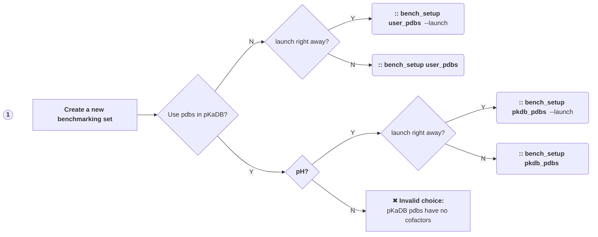
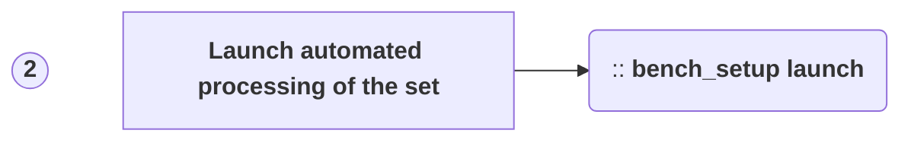
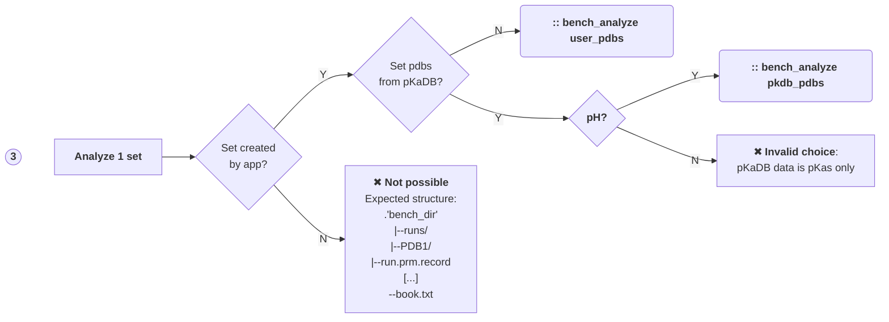
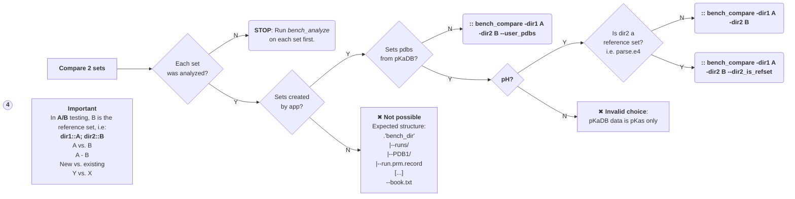

# MCCE_Benchmarking app

## Four main choices in MCCE_Benchmarking:
### 1. Create a new benchmarking set (with a "launch right away" option)
### 2. Launch the automated runs for the set
### 3. Analyze one set of runs
### 4. Compare two sets of runs (after each set is analyzed)

__All these correspond to command line "entry points", which the flowcharts below overview.__  

## Flowchart for the current entry points:

### `bench_setup + [user_pdbs or pkdb_pdbs sub-command]` handles the data & script setup:


### `bench_setup launch` is used if `--launch` was not used during data & script setup:


### `bench_analyze` does an "intra set" analysis; output folder: `-bench_dir` path/analysis:



### `bench_compare` does an "inter sets" analysis; output folder: `-o` value:


  * Note: The flag `--dir2_is_refset` indicates that 'dir2' is the _name_ of a packaged reference dataset, currently __parse.e4__ (pH titrations using the pKaDBv1 pdbs); without it, dir2 is a path.


### Notes on processing:

In the flowcharts above, __`bench_setup launch`__ means starting the batch-processing of the entire set (via creation of a crontab entry).  
This can be done two ways:
  1) During `bench_setup [user_pdbs or pkdb_pdbs]` with the --launch flag;
  2) Using `bench_setup launch` + args;

In case there is a problem with the automated scheduling, the processing can still be done 'batch by batch' at the command line using `bench_bath`, the entry point for batching (which is what the crontab uses).  
After activating the conda env where MCCE_Benchmarking is installed, provide -job_name if your script setup was not default:

```
#  The batch size can be changed every time the cli is called:
> cd A
> bench_batch -bench_dir . -n_batch 15

```

#### Monitor the state of processing by listing the sentinel file:
```
# pattern:
# > ls -l A/runs/*/<sentinel_file> | wc -l  # how many runs have completed the step that creates <sentinel_file>?
  > ls -l A/runs/*/pK.out | wc -l           # how many runs have completed step4?
```
